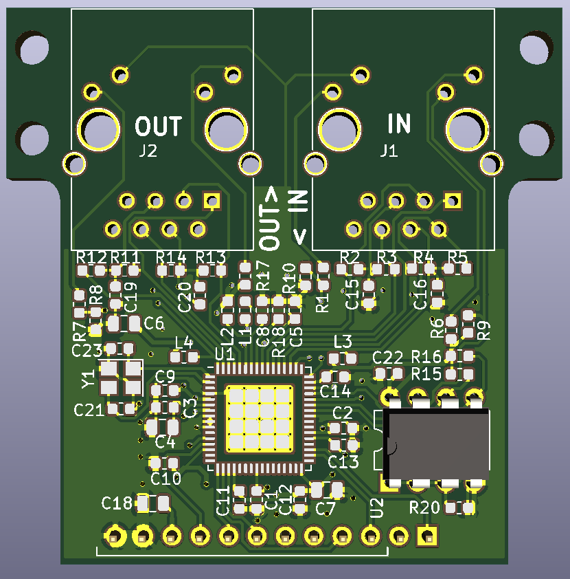

# LAN9252-SPI adapter board design

Starting point was [this open source project](https://github.com/yuqlid/EtherCAT_shield_v1). Stripped schematic to bare minimum, based on EVB-LAN9252-SPI. Left only SQI PDI, then minified board area. Two layers, almost all components on single side for easier assembly and embedding into target devices.

Adapter board, first revision, straight from KiCad.

[IBOM can be found here](https://kubabuda.github.io/ecat_servo/html/lan9252rev1_ibom.html)

Looks good. Board came out similar to EasyCAT Pro. Breakout header is compatible, additionally alongside it has full SQI exposed. Also EEPROM chip is THT in socket for simple swap if ESI flashing goes wrong and bricks device. Now forward to board house of choice, and wait for PCBs to arrive.

Spoiler alert: it worked good enough for what I needed, for practical use you better wait for something better or buy EasyCAT PRO

[Next: Testing LAN9252 board](https://kubabuda.github.io/ecat_servo/003-lan9252-board-tests)

[Back to the table of contents](https://kubabuda.github.io/ecat_servo)