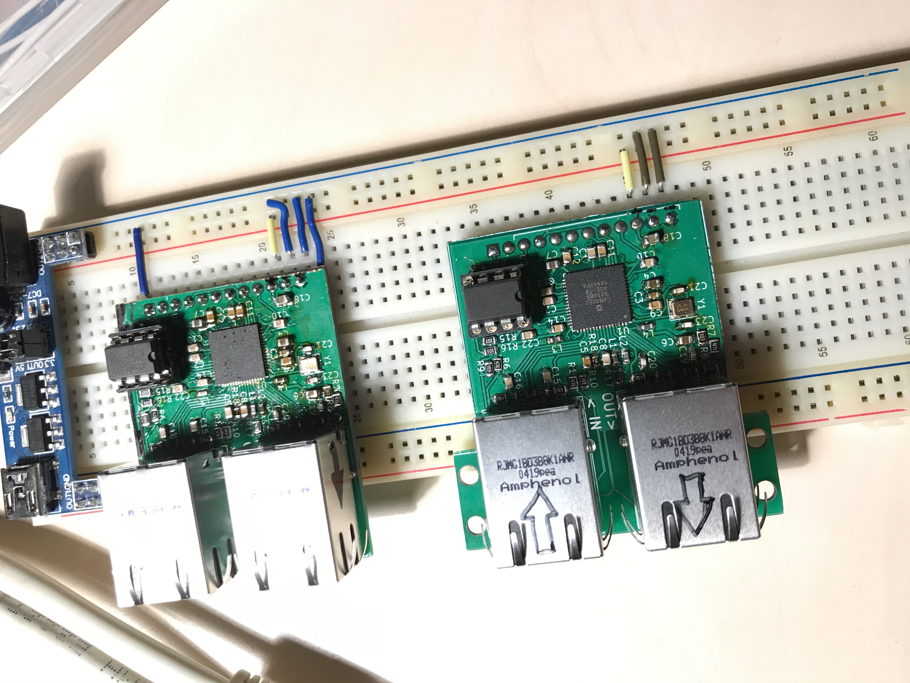
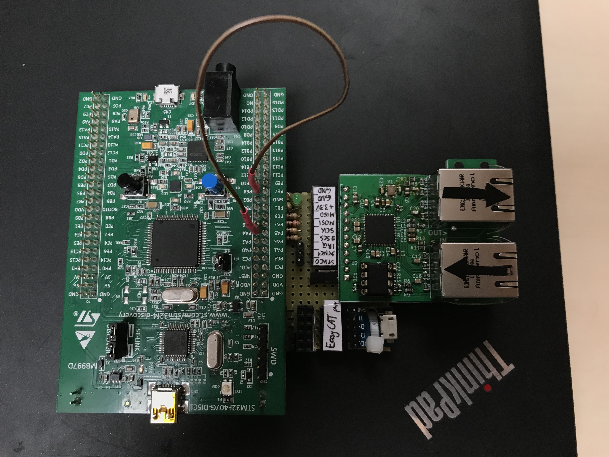

# LAN9252-SPI adapter assembly and testing

## Assembly

PCBs arrived from board house

First one is already assembled. It is dirty from resin-based flux, but looks OK

Connected to Ethernet port, and powered up. Nothing bad happened. Flashed with DIGIO ESI (EtherCAT Slave Info), restarted, opened Simple EtherCAT Explorer and looks it is working.

Now to make it work with microcontroller.

## Testing

[Lets start with EasyCAT Arduino library on ATMega, using platformio](https://github.com/kubabuda/ecat_servo/blob/master/examples/EasyCAT_arduino)

It is working. How stable is it? Turns out not very much. After random period up, usually few minutes, ESC is either disconnected from master or starts to spew garbage values. What could be wrong? First culprit is power that was supplied from 3V3 regulator on Arduino. Lets add another one, powered from separate USB cable. That worked. For convinience, to have only 1 USB cable connected, 5V line to separate regulator can be pulled from ISCP header

BTW, turns out that LAN9252 lines are not 5V tolerant. Suprise, ESC is working entire time without issues, but is uncomfortably close to absolute maximum rating. Voltage level shifter fixes that.

Now on to port that STM32F4 Discovery board. Built quick adapter using SPI1 pinout exposed on STMBL extension header. Problem with power supply repeats. 3V3 from EVB is not good, another USB cable just to power up ESC is needed.

It is working too. But STMBL is using StdPeriph drivers. Time to ditch Arduino code and [port SOES to SPL](https://github.com/kubabuda/ecat_servo/blob/master/examples/EasyCAT_SPL) 

## Known issues

- Problem with OUT port. It is treated as network termination, following EtherCAT devices connected there are not detected by master.
- Proper separation of chassis ground from device ground with clearance will be needed beyond lab bench stage.
- All components should be on single side to simplify PCBA.
- Few silkscreens were messed up.
- ESC chip in TQFP housing would be easier to hand solder.
- So far EEPROM replacing was never needed, even at most messy initial stages. EEPROM should be SMD, to shave BOM cost and board size.
- Cheaper RJ45 magjack connectors were found (HanRun HR911105A)

TLDR: dont build this version. It worked good enough for my use case (single node development), but if you think of using it for anything practical buy EasyCAT PRO or wait for something better.

[Next step: make CoE stack work on new hardware](https://kubabuda.github.io/ecat_servo/004-lan9252-with-coe-stack)

[Prev: LAN9252-SPI PCB design](https://kubabuda.github.io/ecat_servo/002-lan9252-board-design)

[Back to the table of contents](https://kubabuda.github.io/ecat_servo)
