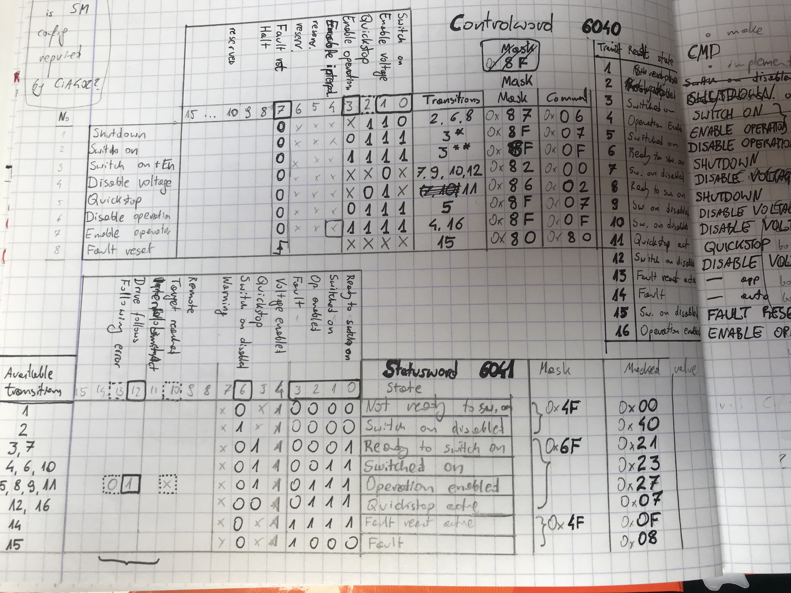
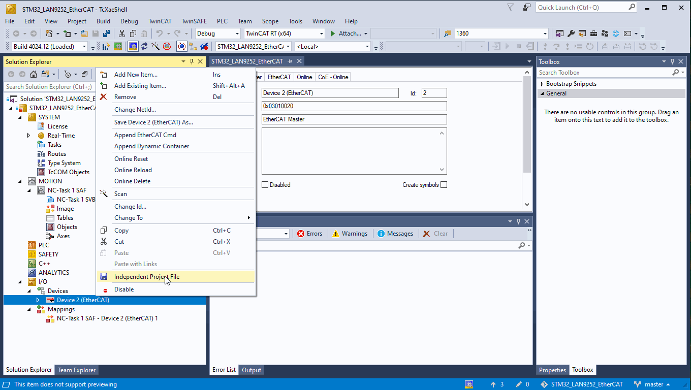
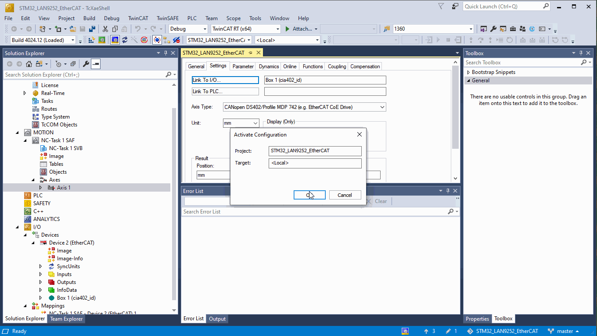
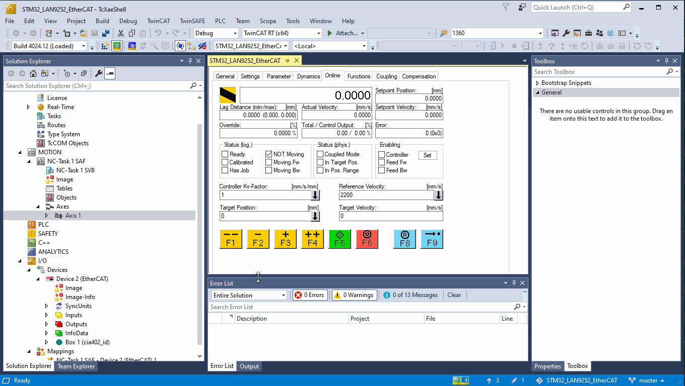

# LAN9252-SPI with SOES

Luckily SOES has HAL file for LAN9252 with SPI, only SPI config, read and write need to be implemented.

[Example SOES application on LAN9252 with STM32F4](https://github.com/kubabuda/ecat_servo/blob/master/examples/SOES_LAN9252)

And example application is running on custom device. Great.

# Speed benchmarking

We already know PDOs size. RxPDO (command from master to servodrive) will be `uint16_t` controlword + `uint32_t` position command, TxPDO (feedback from our servo device) is the same size: `uint16_t` statusword, `uint32_t` position actual, so it is 6 bytes in, 6 bytes out. We can set it in EasyCAT and see how long does it take to cycle. Then we can tweak PDOs in SOES project, and test speed the same way.

## EasyCAT

Measured is PDI communication cycle time (`EASYCAT.MainTask();`) from start to return.

| ESC     | SSC       | MCU     | SPI driver | SPI speed | value [us] |
| ------- | --------- |:-------:|:----------:|:---------:|:----------:|
| LAN9252 | EasyCAT   | AtM328P |  Arduino   | 8 MHz     | 196        |
| LAN9252 | EasyCAT   | STM32F4 |  Arduino   | 8 MHz     | 210        |
| LAN9252 | EasyCAT   | STM32F4 |  Arduino   | 42 MHz    | 118        |
| LAN9252 | EasyCAT   | STM32F4 |  Arduino   | 42 MHz    | 107        |
| LAN9252 | EasyCAT   | STM32F4 |  SPL       | 5.25 MHz  | 123        |
| LAN9252 | EasyCAT   | STM32F4 |  SPL       | 42 MHz    | 35         |

## SOES

Measured is how long does polled `ecat_slv();` take from start to return. No interrupts, should be more deterministic and consistent. STM32F405 at 168 MHz. SPI1 at 42 MHz

- Cables connected, ECAT master not connected: `[ESC benchmark] 0028 us (028 top)`
- ECAT master connected, slv in OP: `[ESC benchmark] 0072 us (0280 top)`

Results are... not great for LAN9252 with CoE stack. It was okay with EasyCAT library, but something with SOES setup makes it much slower, and to make things worse timing is not consistent. Considering app notes from Microchip on measuring cycle time (with Slave Stack Code from Beckhoff) this should look way better, and deserves proper investigation.

# SOES as Arduino library

At this point it is not much work to port SOES as Arduino library.

[Sample project using popular STM32F103 "BluePill" devboard](https://github.com/kubabuda/ecat_servo/blob/master/examples/SOES_arduino)

# CiA402 profile implementation

First step is to get CiA 402 state machine diagram, for example from datasheet of some servodrive implementing it. [Hiwin has it described well](https://hiwin.us/wp-content/uploads/ethercat_drive_user_guide.pdf) . From this one can calculate commandword masks, command codes for each transition, statusword masks and status codes for each state. Here goes resulting transition table:

Then just retype these codes into .c header, connect it to get state machine code, wire it with object dictionary, set correct `ProductCode="#x00020192"` (0x192 is 402d, CiA402 profile code)... Oh, and add dummy motion control application: loopback `Obj.Position_actual = Obj.Target_position;`

[CiA402 dummy on STM32F1](https://github.com/kubabuda/ecat_servo/blob/master/examples/SOES_arduino)

# TwinCAT configuration

Way to test if node implementation is working is making it work with TwinCAT. For that one needs to create project, and add point to point motion control with single axis. Connect device, scan for boxes and select new device in axis settings.

To launch project, one needs to enable configuration. If it is first time, fill captcha in prompt window to generate temporary license key for NC module

Configuration should be now active and new device should reach OP (Operational state of EtherCAT state machine). Now it is time to set target velocity and enable controller. Go to `Online` tab to do it. Then reset errors (F8 key or blue button), and activate axis (F5 or green button). 

This is how it should look like. Dummy servo responds to commands, and reports it went exactly where controller requested.

[Next: LAN9252 PCB rev 2](https://kubabuda.github.io/ecat_servo/005-lan9252-rev2)

[Prev: LAN9252 board assembly](https://kubabuda.github.io/ecat_servo/003-lan9252-board-tests)

[Back to the table of contents](https://kubabuda.github.io/ecat_servo)
