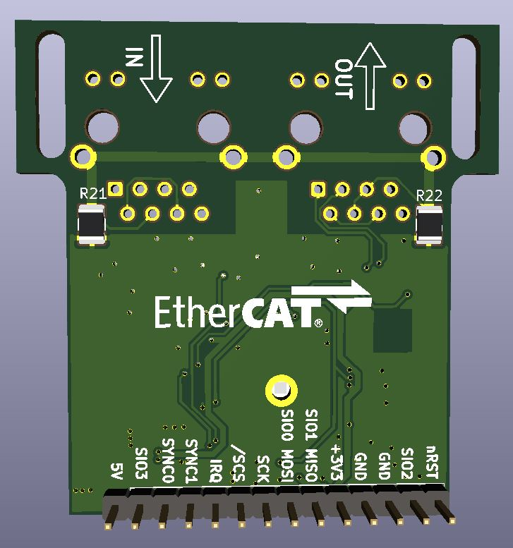

# LAN9252-SPI board, second revision

In the meantime some things to correct were found in first revision of SPI adapter

[IBOM can be found here](https://kubabuda.github.io/ecat_servo/html/lan9252rev2_ibom.html)

Design is ready to order and test, but due to performance benchmark results different approach was selected

[Next: AX58100 board](https://kubabuda.github.io/ecat_servo/006-ax58100-board)

[Prev: CoE stack work on LAN9252](https://kubabuda.github.io/ecat_servo/004-lan9252-with-coe-stack)

[Back to the table of contents](https://kubabuda.github.io/ecat_servo)
