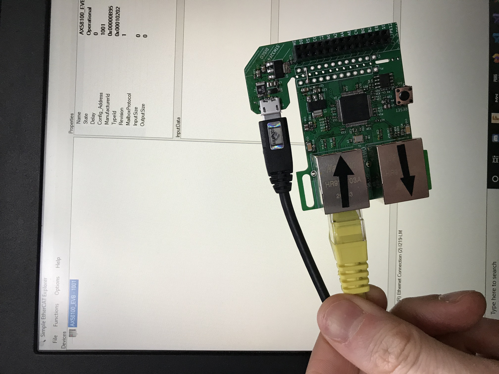

# AX58100 

## Board design

LAN9252 indirect register addressing is complex ... frankly it feels cumbersome. Building DMA for that is certainly possible (with few state machines and plenty interrupts) but super messy and not that efficient either. The original ESC from Beckhoff, ET1100, was much more straigtforward to work with. To see the difference, just compare SOES HAL files for [ET1100](https://github.com/OpenEtherCATsociety/SOES/blob/master/soes/hal/rt-kernel-twrk60/esc_hw.c) vs [LAN9252](https://github.com/OpenEtherCATsociety/SOES/blob/master/soes/hal/linux-lan9252/esc_hw.c). Look at line count of respective files should be enough. 
Unfortunately ET100 costs 2-3 times as much and requires more external elements. Luckily, we can eat the cake and have it too thanks to ASIX, Chinese company I have never heard of before. They got license from Beckhoff and made improved derivative, AX58100. ASIX chips are not really offered via typical western suppliers, but few Aliexpress sellers have it. I risked few dozen of $, and while waiting for shipping I also designed PCB based on LAN9252 second revision. This time STM32F4 Discovery adapter with 3.3V regulator (and separate USB for power) is part of PCB that can be snapped off like ST Link from Nucleo boards.

[IBOM can be found here](https://kubabuda.github.io/ecat_servo/html/ax58100rev1_ibom.html)

# AX58100 board assembly

Repeating approach that worked with LAN9252, DIG IO ESI was flashed at first, and it was working right off the bat. Board is doing good so far. 

# AX581000 with SOES

This ESC is based on ET1100, and one of HAL setups in SOES source target this chip. As was with LAN9252, lets implement SPI read/write and go to town. 

It is not working. Why? Let us check datasheet and manual for migration from ET1100. To enable SPI PDI, 4K7 pullup resistor to 3v3 is needed on SCS_FUNC. Is it enough? Hardware wise yes, overall no. Some configuration registers are different on AX58100. More head banging against docs ensures. AX58100 datasheet is rather short, what is missing there can be found in ET1100 datasheet. Luckily ASIX has code samples for STM32 Nucleo available on their webpage, and those include ESI files with correct configuration bytes. For SPI setup turns out `HIES` register (Host Interface Extend Setting and Drive Strength) which is mapped to configuration byte 0x0A, should be set to 0x1a (INT edge pulse length, 8 mA Control + IO 9:0 Drive Select). It is in area covered by checksum, so we need to calculate new one too.

After all that time and head scratching, new board is reaching OP with SOES application. Radiator was added to mitigate overheating while working on getting right PDI configuration in ESI file. Now that it is correct, feels like it is not probably wont needed will test on next boards.

[Example: CiA 402 application on AX58100 with STM32F4](https://github.com/kubabuda/ecat_servo/blob/master/examples/SOES_CIA402_AX58100)

# Optimizing for precision and speed

## DMA

PDO reads should really be handled by DMA. Let us configure it and see how it goes. It works an then stops, it either randomly disconnects or starts to spew trash values, causing CiA402 state machine errors. Without DMA everything was working and was stable, so it is not power issue. Time to connect logic analyzer to see what is happening. At hand is cheapo FX2 based probe, to make it keep up SPI clock prescaler needs to be bigger, to drop clock frequency from max 41 MHz, to 5.125MHz. At this speed, transmission with DMA is stable back again. What can it be?

Turns out, simple SPI implementation (sending byte by byte) adds significant breaks between each byte. DMA sends all bytes in one go, back to back. SPI addressing can be done in 2 bytes, or 3 bytes (with wait state byte) - second solution is meant to give ESC enough time to fetch valid data from memory into SPI, but there is minimal cycle time value, `Tread` for that. According to datashet `Tread` should be at least 240 ns. Using 3 byte addressing with wait state should solve it, and it does, up to 21 MHz. Unfortunately at SPI1 max speed, 41Mhz, with current setup problem persists. Maybe it is caused by current board layout and it could be fixed on next HW revision? Then again, it looks to be fast enough to work on STMBL, and SPI2 on ODrive tops out on 21 MHz anyway so for now it looks good enough - on to next problems.

## AX58100 moving towards interrupt mode - PDI interrupt and DC synchronization

It took a bit but now is working too. One needs to adjust settings in TwinCAT: assign Sync Unit to local device

Result is stable sync signal with very low jitter: about 150 ns even in large EtherCAT networks, according to Beckhoff claims

[TODO] oscilloscope shot of SYNC0 signals

## Benchmark results

Despite slower SPI clock speed, cycle time is much better than LAN9252:

### Polling (blocking SPI). SPI1 at 42 MHz

- Cables connected, ECAT master not connected: `[ESC benchmark] 0006 us (0006 top)`
- ECAT master connected, slv in OP: `[ESC benchmark] 0015 us (0059 top)`
- ECAT master connected, slv in OP, network startup hiscore reset: `[ESC benchmark] 0015 us (0024 top)`

### Added CiA402 loopback, SPI1 at 42 MHz:

- ECAT master connected, slv in OP, network startup hiscore reset: `[ESC benchmark] 0017 us (0025 top)`

### DMA SPI + CiA402 loopback. Prescaler 2 (42 MHz), SPI reads from ESC are **unstable - transmission errors**

- ECAT master connected, slv in OP: `[ESC benchmark] 0017 us (0063 top)`
- ECAT master connected, slv in OP, network startup hiscore reset: `[ESC benchmark] 0017 us (0025 top)`

### DMA SPI + CiA402 loopback. Prescaler 4 (21 MHz: 2x slower clock), **2 us slower**

- Cables connected, ECAT master not connected: `[ESC benchmark] 0009 us (0009 top)`
- ECAT master connected, slv in OP: `[ESC benchmark] 0019 us (0073 top)`
- ECAT master connected, slv in OP, network startup hiscore reset: `[ESC benchmark] 0019 us (0030 top)`

Seems like all that extra work with laying out another HW revision, and switching to new ESC from relatively unknown company, paid out.
For now I will continue with AX58100. If anyone feels like stepping up and optimizing LAN9252 driver, PRs are welcome.

[Next: LinuxCNC setup](https://kubabuda.github.io/ecat_servo/007-linuxcnc-setup)

[Prev: LAN9252 PCB rev 2](https://kubabuda.github.io/ecat_servo/005-lan9252-rev2)

[Back to the table of contents](https://kubabuda.github.io/ecat_servo)