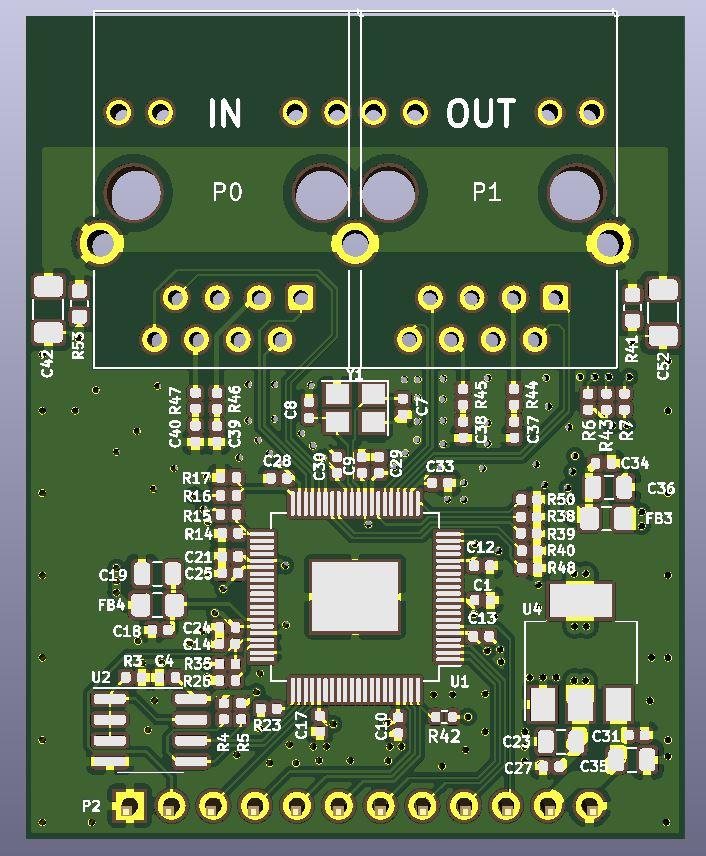
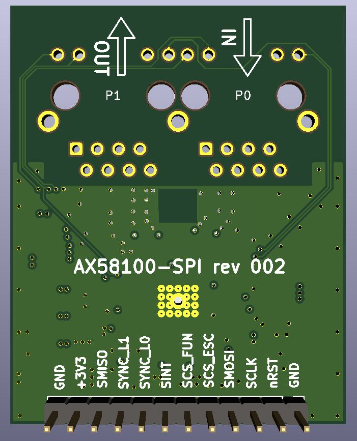
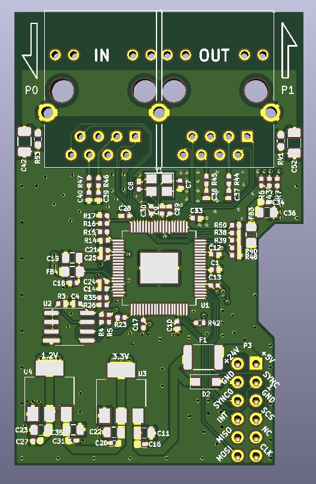
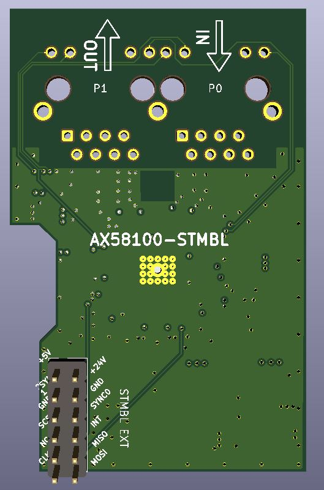

# AX58100 board rev 2

Again, laundry list of bugs and missing features on current HW was found:

- Port silkscreen labels are reversed, of course. Just compare PCB renders and photos with stickers on RJ45s
- Switch to 4 layer PCB for better noise protection and simplified, cleaner routing 
- Differential pairs routing between ESC and RJ45 should really use matched length and impedance
- SPI signal traces should be checked
- adapter for target device, like STMBL, will be needed (with 5V -> 3V adapter and SWD connector for STM32)
- I2C resistors can be 4K7 to simplify BOM
- Add 4K7 pullup resistor to ESC_FUNC pin 
- ditch RESET button, or use more common footprint
- rework board layout: RJ45 should be side to side for easier housing design, chassis clearance is to be improved

Things that would be nice for next revision:

- EEP_LOADED and ERR status LEDs: get them on such small board
- ESD protection chip for RJ45 connectors: source anything good and available

[IBOM can be found here](https://kubabuda.github.io/ecat_servo/html/ax58100rev2_ibom.html)

STMBL adapter based on that revision:

[IBOM can be found here](https://kubabuda.github.io/ecat_servo/html/ax58100_stmbl_ibom.html)

[Next: Woring with EtherCAT devives](https://kubabuda.github.io/ecat_servo/009-software-tools)

[Prev: LinuxCNC setup](https://kubabuda.github.io/ecat_servo/007-linuxcnc-setup)

[Back to the table of contents](https://kubabuda.github.io/ecat_servo)
