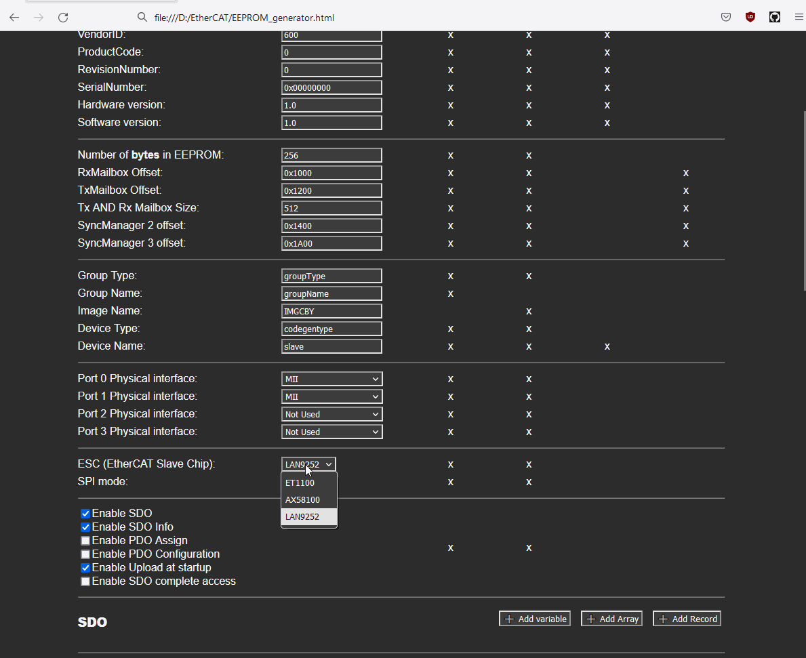

# EtherCAT device development - software tools

Chip shortage made ESC chips 10x more expensive for a while. AX58100 board rev 2 purchase is put on hold. To do something productive in the mean time, let us talk about working with EtherCAT device development. what one needs to do and how to do it, preferrably with free tools.

1. [Prepare ESI binary (that goes into EEPROM chip on slave device): `.bin` or `.hex`](#edit-esc-settings-and-object-dictionary)
2. [Prepare ESI XML used by EtherCAT master: some settings can be detected over network, some (like available DC modes) are only in that XML file](#edit-esc-settings-and-object-dictionary)
3. [Prepare `.c, .h` source files for used EtherCAT / CANopen stack ran on slave device MCU](#edit-esc-settings-and-object-dictionary)
4. [Program MCU itself](#program-mcu)
5. [Program EEPROM with ESI binary](#programming-esi-eeprom-and-checking-communication )
6. [Test if device is available on network, reaches OP status, communicates](#programming-esi-eeprom-and-checking-communication )
7. [Test device profile specific functions](#device-profile-testing)

# Device profile testing

Starting from last point: de facto standard software for EtherCAT is Beckhoff TwinCAT. CiA402 profile is available in TwinCAT NC module, this is what I opted to use, and it turned out well. TwinCAT is available only on Windows, as one can tell from its name. [There are good TwinCAT tutorials elsewhere](http://www.contactandcoil.com/twincat-3-tutorial/quick-start/), and some instructions (on what is needed for this project) are available [here, in other entries](https://kubabuda.github.io/ecat_servo/010-twincat-3-1-setup).
One very good thing when using TwinCAT for tests is its great diagnostics. Error detection with error specific codes and good documentation on their webpage - chances of getting stuck clueless are small even for newcomer.

# Programming ESI EEPROM and checking communication 

This can be done with TwinCAT too, but we have lighter, open solutions that will work on Linux too.

## Simple EtherCAT Opensource Master: SOEM

### Compiling SOEM on Windows

SOEM is working on Windows 10, just complilation takes few extra steps. [Based on this instruction](https://www.programmersought.com/article/2825937087/):

- You need to have Visual Studio installed. 
- Grab release from [https://openethercatsociety.github.io/](https://openethercatsociety.github.io/), unpack. Open `x86 Native Tool Command Prompt for VS2019` (or whatever VS you got) and `cd` into SOEM release directory.
- Find path to `vcvarsall.bat`, for VS2019 Community it is `C:\Program Files (x86)\Microsoft Visual Studio\2019\Community\VC\Auxiliary\Build`
- Use your path in following command:

`make_libsoem_lib.bat "C:\Program Files (x86)\Microsoft Visual Studio\2019\Community\VC\Auxiliary\Build\vcvarsall.bat" x86`
`make_test_win32_all.bat`

- Subcatalog `test\win32` should appear. It contains, among others, `slaveinfo` and `eepromtool` catalogs with tools we want to use.

## Read Ethernet interface identifier

Slave info doesnt require Administrator privileges to work.
To list available interfaces run

`cd test\win32\slaveinfo`
`slaveinfo.exe`

You should get something like this:

```powershell
PS D:\> .\EtherCAT\SOEM\SOEM-1.3.1\test\win32\slaveinfo\slaveinfo.exe
SOEM (Simple Open EtherCAT Master)
Slaveinfo
Usage: slaveinfo ifname [options]
ifname = eth0 for example
Options :
 -sdo : print SDO info
 -map : print mapping
Available adapters
Description : Microsoft, Device to use for wpcap: \Device\NPF_{UUUUUUUU-UUUU-UUUU-UUUU-UUUUUUUUUUUU}
Description : Microsoft, Device to use for wpcap: \Device\NPF_{VVVVVVVV-VVVV-VVVV-VVVV-VVVVVVVVVVVV}
Description : Intel(R) Ethernet Connection (2) I219-LM, Device to use for wpcap: \Device\NPF_{XXXXXXXX-XXXX-XXXX-XXXX-XXXXXXXXXXXX}
Description : Microsoft, Device to use for wpcap: \Device\NPF_{WWWWWWWW-WWWW-WWWW-WWWW-WWWWWWWWWWWW}
End program
```

Select interface you are going to use: Ethernet connection, copy its identifier and pass to slaveinfo

```batch
slaveinfo.exe \Device\NPF_{XXXXXXXX-XXXX-XXXX-XXXX-XXXXXXXXXXXX}
```

## Detect slave device

Make sure your device is connected to Ethernet port of your Laptop/PC with Ethernet cable and powered up.

```powershell
.\slaveinfo.exe "\Device\NPF_{XXXXXXXX-XXXX-XXXX-XXXX-XXXXXXXXXXXX}"
```
You should get something like 

```powershell
C:\EtherCAT\SOEM\test\win32\slaveinfo>slaveinfo.exe \Device\NPF_{XXXXXXXX-XXXX-XXXX-XXXX-XXXXXXXXXXXX}
SOEM (Simple Open EtherCAT Master)
Slaveinfo
Starting slaveinfo
ec_init on \Device\NPF_{XXXXXXXX-XXXX-XXXX-XXXX-XXXXXXXXXXXX} succeeded.
1 slaves found and configured.
Calculated workcounter 3

Slave:1
 Name:cia402_id
 Output size: 48bits
 Input size: 48bits
 State: 4
 Delay: 0[ns]
 Has DC: 1
 DCParentport:0
 Activeports:1.0.0.0
 Configured address: 1001
 Man: 00000b95 ID: 00020192 Rev: 0000002a
 SM0 A:1000 L: 512 F:00010026 Type:1
 SM1 A:1200 L: 512 F:00010022 Type:2
 SM2 A:1400 L:   6 F:00010024 Type:3
 SM3 A:1a00 L:   6 F:00010020 Type:4
 FMMU0 Ls:00000000 Ll:   6 Lsb:0 Leb:7 Ps:1400 Psb:0 Ty:02 Act:01
 FMMU1 Ls:00000006 Ll:   6 Lsb:0 Leb:7 Ps:1a00 Psb:0 Ty:01 Act:01
 FMMUfunc 0:1 1:3 2:3 3:0
 MBX length wr: 512 rd: 512 MBX protocols : 04
 CoE details: 03 FoE details: 00 EoE details: 00 SoE details: 00
 Ebus current: 0[mA]
 only LRD/LWR:0
End slaveinfo, close socket
End program
```

## Flashing EEPROM ESI

To flash EEPROM with .bin file, run command:

```cmd
eepromtool.exe \Device\NPF_{XXXXXXXX-XXXX-XXXX-XXXX-XXXXXXXXXXXX} 1 -w "soes-esi\eeprom.bin"
```
Or with powershell:

```powershell
.\eepromtool.exe "\Device\NPF_{XXXXXXXX-XXXX-XXXX-XXXX-XXXXXXXXXXXX}" 1 -w "soes-esi\eeprom.bin"
```

To flash with .hex, add `-i` flag

```powershell
.\eepromtool.exe "\Device\NPF_{XXXXXXXX-XXXX-XXXX-XXXX-XXXXXXXXXXXX}" 1 -wi "soes-esi\eeprom.hex"
```

When EEPROM write is done, power device off and on back again to force applying new configuration on boot. Or reset ESC (and MCU) if dev board has such button.

## Binary file comparison tool 

### Windows

If you have to compare and edit binary files on Windows, [VBinDiff](https://www.cjmweb.net/vbindiff/VBinDiff-Win32) is nice option

```cmd
VBinDiff eeprom.bin  eeprom(1).bin
```

There is also [HEX editor](https://marketplace.visualstudio.com/items?itemName=ms-vscode.hexeditor) VS code plugin from Microsoft. It has nice UI but is slower than VBinDiff and reloads file every time you switch to its tab - that makes working with multiple files poor experience.

### Linux

On linux you can pipe hex dumps and diff them. This is linux specific and was not working in git bash on Windows.

```bash
diff -y <(xxd foo1.bin) <(xxd foo2.bin)
```

## Checking communication

Using Windows anyway, one can run simple [EtherCAT Explorer](https://sourceforge.net/projects/ethercat-explorer/). There is RxPDO value preview and user can type his own values into TxPDO

# Program MCU

Obviously there is is nothiging specific in programming MCU that happens to be EtherCAT device. Just make sure you had reset ESC with (or before) your microcontroller before running changed code to force clean boot sequence.

# Edit ESC settings and Object Dictionary

Points 1-3 are grouped together because all these files (.c, .h sources, ESI binary and XML) have to be in sync. ESI XML acts as manifest for OD impemented in C source, ESC settings too are duplicated in 2 or 3 places. One can do it by hand but it will be PITA. Available tools depend on selected software stack

## Beckhoff original Slave Stack Code:

ETG provides SSC tool free of charge, but you will not make open source with it.

## SOES:

The way to go is rt-labs EtherCAT SDK. This is Eclipse plugin based on SOEM library, it is also available as complete IDE installation. Works on Windows, new version is running on Linux too. Has nice UI and builtin explorer with PDO values tracing. If this is your work and your employer can spare 1K5 EUR for license, make him go for it.

Alternatively one can write his own codegen tool. One good starting point would be `objdictgen` from [`CanFestival`project](https://canfestival.org/doc). Beware, old Python versions with dependencies.

Another would be `EEPROM_generator.html` made by Victor Sluiter. Nice thing (from usage, portability and maintenace point of view) is that it is plain webpage with logic in Javascript file so that no build system or web server is needed. The only dependency is web browser, that should simplify usage, portability and minimize tool maintenance work in years to come.
I decided to start with web based generator tool. Made it generate SOES 3.X compatible code and added OD editor. While this solution is way less feature packed than SDK, so far it works all right. Maybe it will be released later, when it is better tested.


Good side of using OSS tool is that user can add functions he needs. AX58100 is relatively new ESC from smaller company. While it is marketed as ET1100 compatible, files generated for ET1100 need patching. 



New web tool supports AX58100 directly.


[Next: TwinCAT crash course](https://kubabuda.github.io/ecat_servo/010-twincat-3-1-setup)

[Prev: AX58100 rev 2, STMBL adapter](https://kubabuda.github.io/ecat_servo/008-ax58100-board-rev2)

[Back to the table of contents](https://kubabuda.github.io/ecat_servo)
