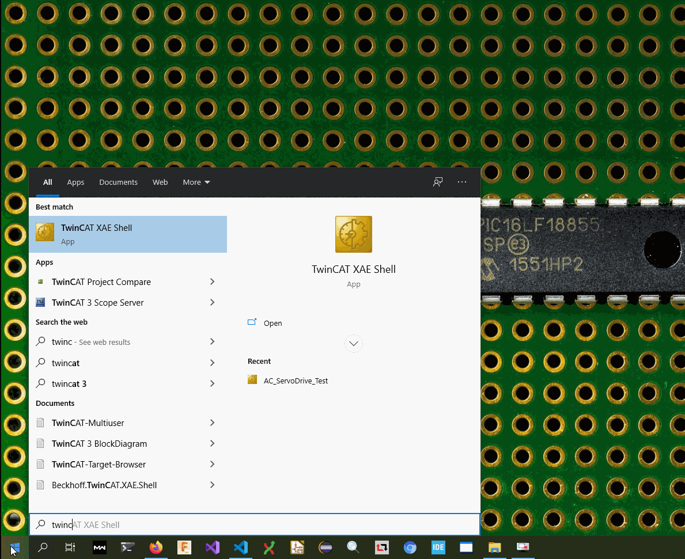
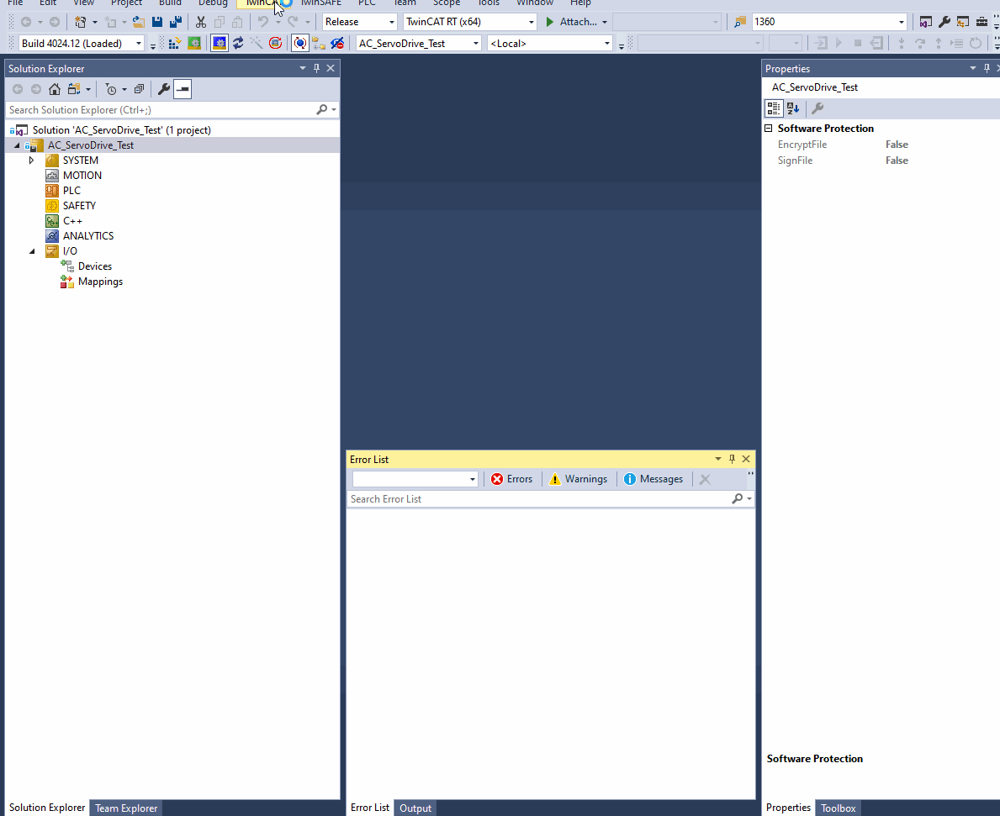
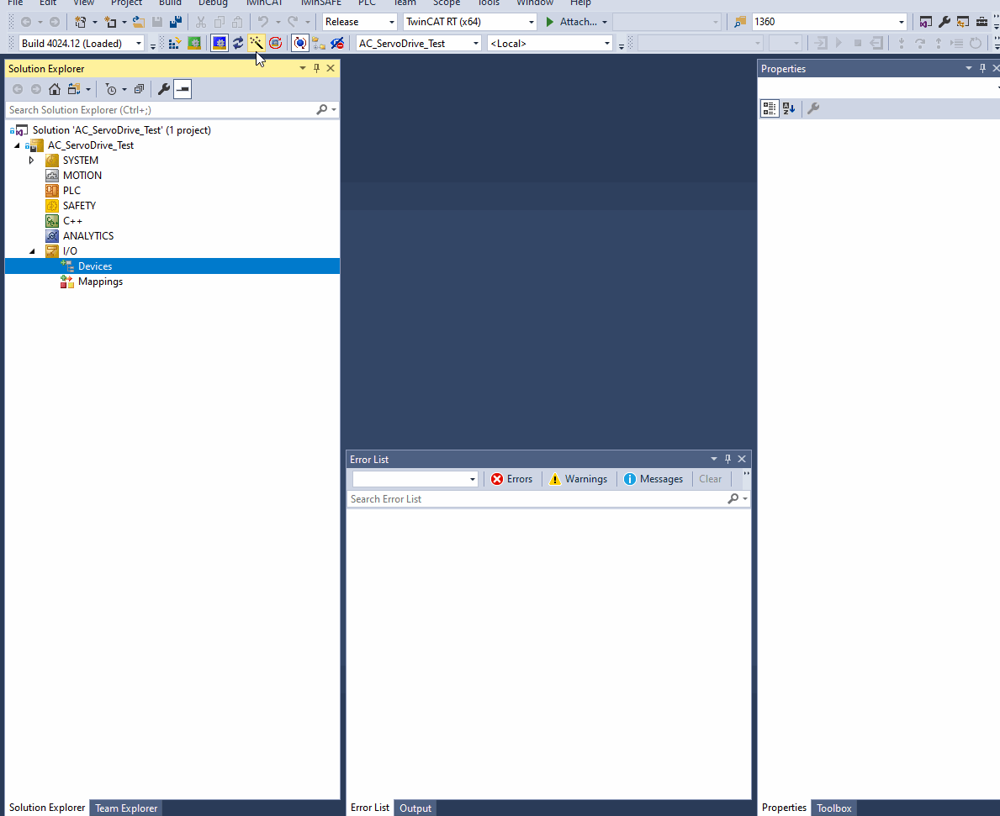
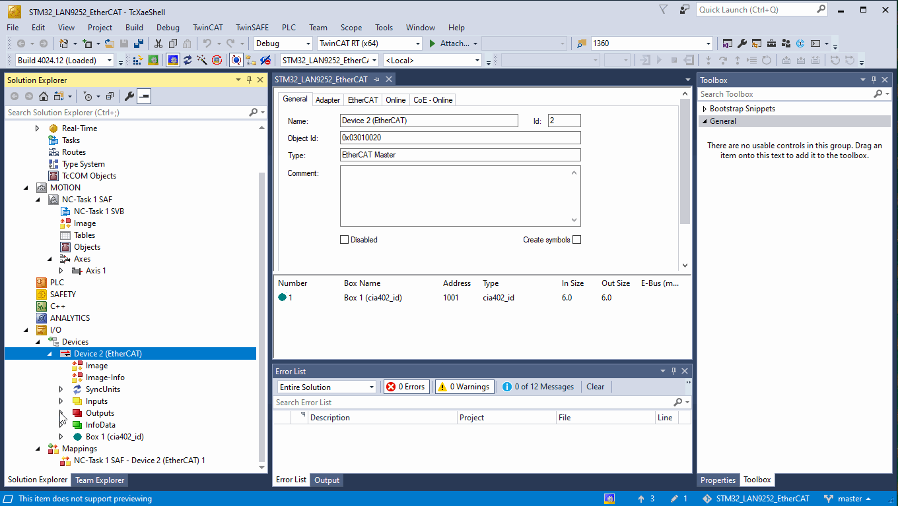

# TwinCAT 3.1 crash course

De facto standard software for EtherCAT is Beckhoff TwinCAT. It is available only on Windows, as one can tell from its name (The WINdows Control Automation Technology).
[There are good third party TwinCAT tutorials elsewhere](http://www.contactandcoil.com/twincat-3-tutorial/quick-start/). 
One very good thing when using TwinCAT for tests is its great diagnostics. Error detection with error specific codes and good documentation on their webpage - chances of getting stuck clueless are small even for newcomer.

## Installation

Go to [Beckhoff page](https://www.beckhoff.com/pl-pl/support/download-finder/software-and-tools/), make free myBeckhoff account, download ~1 GB TwinCAT 3 XAE installer, unpack and install. After installation is done, launch it. If you opted not to integrate TwinCAT with existing Visual Studio and installed it in separate VS Shell, launch `TwinCAT XAE Shell`



Then you need to install realtime driver. Fro menu select `TwinCAT / Show Realtime Ethernet compatible devices... `, new window for `Application TcRteInstall` will ask for required admin privileges and open list of available devices. Select Ethernet adapter you want to use and install driver on it.



If needed, [Beckhoff docs are here](https://infosys.beckhoff.com/content/1033/tc3_installation/447485323.html).

## Starting new project

Create new project, then add EtherCAT master. Open solution explorer pane, expand I/O section and click on Devices tree. Then click `Scan` button



If your slave devices are already connected, you can scan for boxes. When TwinCAT has no builtin device support, it will ask of user wants to use online ESI (read from device EEPROM, can be less complete than XML ESI) or search for XML on Beckhoff page.

## Custom devices ESI

When working with new device, to enable TwinCAT support, copy its ESI XML to directory where TwinCAT is keeping known ESI declaration. Default path is

```
C:\TwinCAT\3.1\Config\Io\EtherCAT
```


## Motion control - NC module

CiA402 profile is available in TwinCAT NC module. This is good way to test if servo node implementation is working. For that one needs to create project, and add point to point motion control with single axis. Connect device, scan for boxes and select new device in axis settings.


To launch project, one needs to enable configuration. If it is first time, fill captcha in prompt window to generate temporary license key for NC module


Configuration should be now active and new device should reach OP (Operational state of EtherCAT state machine). Now it is time to set target velocity and enable controller. Go to `Online` tab to do it. Then reset errors (F8 key or blue button), and activate axis (F5 or green button). 


This is how it should look like. Dummy servo responds to commands, and reports it went exactly where controller requested.


## Distributed clocks

For extra stable sync signal with very low jitter (about 150 ns even in large EtherCAT networks, according to Beckhoff claims) enable distributed clocks.



